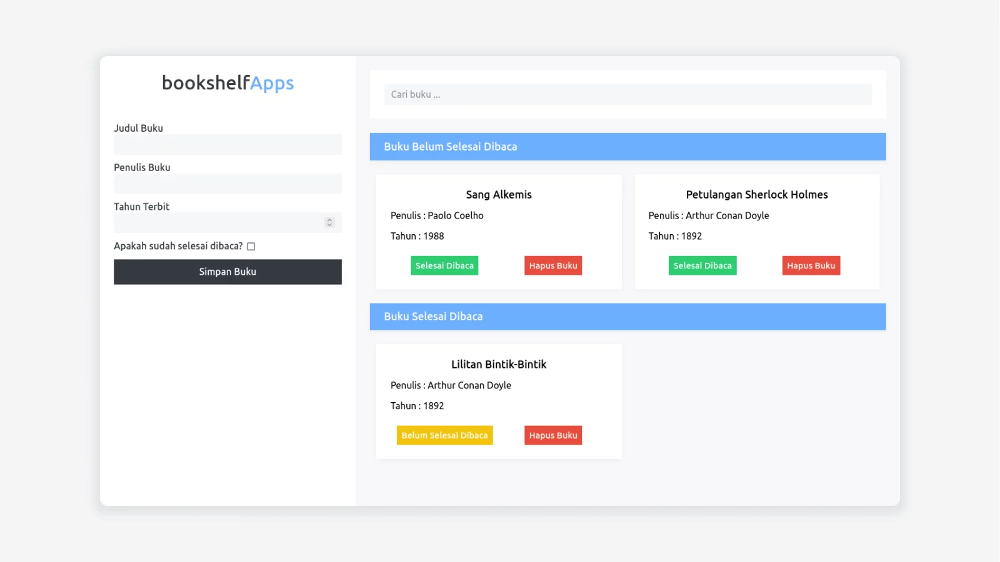

## About Project



This application is a Beginner's Dicoding Front-End final project. Which this final project must implement DOM and LocalStorage in HTML.

[Demo App](https://herdianurdin.github.io/BookShelf-2021/)

### JSON Structure

```JSON
[
  {
    "id": "",
    "title": "",
    "author": "",
    "year": 2000,
    "isComplete": false,
  }
]
```

## License

Distributed under the GPL License. See [LICENSE](LICENSE) for more information.
